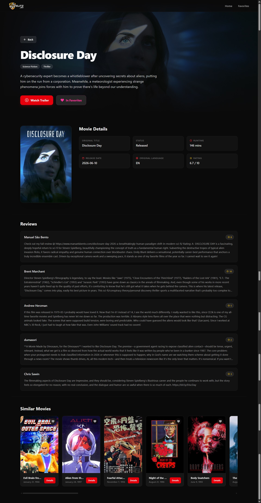

# 🎬 Movie Engine

> **Discover your next favorite movie.**

Movie Engine is a modern movie discovery platform built with **React**, **Vite**, **Tailwind CSS**, and **The Movie Database (TMDB) API**. It enables users to discover trending movies, explore upcoming releases, search for titles, and view detailed movie information through a fast, responsive, and immersive interface.

To improve security, API requests are routed through **Vercel Serverless Functions**, ensuring the TMDB API key remains protected and is never exposed to the client.

---

## ✨ Preview

<div align="center">
  
</div>

---

## 🚀 Features

### 🎥 Movie Discovery

- Trending Movies
- Popular Movies
- Top Rated Movies
- Now Playing
- Upcoming Releases

### 🔍 Smart Search

- Search movies by title
- Fast search results
- Clean and responsive search interface

### 📄 Movie Details

- Cinematic hero section
- High-resolution backdrops
- Movie synopsis
- Genres
- Runtime
- Release date
- Ratings
- Original language
- Official trailer

### ❤️ Favorites

- Save favorite movies
- Persistent favorites
- Dedicated Favorites page

### 🔒 Secure Backend

- Vercel Serverless Functions
- TMDB API key stored securely on the server
- Client requests proxied through API endpoints
- No API key exposed in the frontend

### 📱 User Experience

- Responsive across all devices
- Modern dark UI
- Smooth navigation
- Fast loading experience

---

## 🛠️ Built With

- React
- Vite
- React Router
- Tailwind CSS
- Context API
- TMDB API
- Vercel Serverless Functions
- Vercel

---

## 🏗️ Architecture

```text
React Frontend
       │
       ▼
Vercel Serverless Function
       │
       ▼
TMDB API
```

The frontend communicates with a Vercel Serverless Function, which securely fetches data from the TMDB API using a protected environment variable.

---

## 📂 Project Structure

```text
MovieEngine/
│
├── api/
│   └── movies.js              # Vercel Serverless Function
│
├── public/
│
├── src/
│   ├── assets/
│   ├── components/
│   ├── context/
│   ├── layout/
│   ├── pages/
│   ├── services/
│   └── App.jsx
│
├── package.json
├── vite.config.js
├── vercel.json
└── README.md
```

---

## ⚙️ Installation

Clone the repository

```bash
git clone https://github.com/OlatundeEmmanuelTantolorun/Movie-engine.git
```

Navigate into the project

```bash
cd Movie-engine
```

Install dependencies

```bash
npm install
```

Install the Vercel CLI (recommended for local serverless development)

```bash
npm install -g vercel
```

Start the local development server

```bash
vercel dev
```

---

## 🔐 Environment Variables

Create a `.env.local` file for local development.

```env
TMDB_API_KEY=your_tmdb_api_key
```

The TMDB API key is accessed only inside the Vercel Serverless Function using:

```javascript
process.env.TMDB_API_KEY;
```

For production, add the same environment variable inside your Vercel Project Settings:

```text
Name:
TMDB_API_KEY

Value:
your_tmdb_api_key
```

The API key is never exposed to the browser.

---

## 🌐 Deployment

Movie Engine is deployed on **Vercel**.

Deployment steps:

1. Push the project to GitHub.
2. Import the repository into Vercel.
3. Configure the `TMDB_API_KEY` environment variable.
4. Deploy.

Every push to the `main` branch automatically triggers a new deployment.

---

## 📌 Roadmap

### ✅ Completed

- Trending Movies
- Popular Movies
- Upcoming Movies
- Now Playing
- Top Rated Movies
- Search Movies
- Favorites
- Movie Details
- Trailer Modal
- Secure Backend with Vercel Serverless Functions

### 🚧 In Progress

- Movie Reviews
- Similar Movies
- Cast Information
- Pagination
- Skeleton Loading
- Toast Notifications

### 💡 Future Features

- User Authentication
- Watchlists
- AI Movie Recommendations
- TV Shows
- Dark / Light Theme
- User Ratings
- Movie Collections
- Streaming Availability
- Advanced Filters
- Progressive Web App (PWA)

---

## 📈 Performance Goals

- Responsive across all screen sizes
- Optimized API requests
- Fast page loads
- Secure backend architecture
- Accessible user interface

---

## 🤝 Contributing

Contributions are welcome.

To contribute:

1. Fork the repository.
2. Create a feature branch.

```bash
git checkout -b feature/new-feature
```

3. Commit your changes.

```bash
git commit -m "Add new feature"
```

4. Push your branch.

```bash
git push origin feature/new-feature
```

5. Open a Pull Request.

---

## 🙏 Acknowledgements

- The Movie Database (TMDB)
- React
- Vite
- Tailwind CSS
- Vercel

---

## 📄 License

This project is licensed under the MIT License.

---

## 👨‍💻 Author

**Olatunde Emmanuel Tantolorun**

Frontend Developer passionate about building modern, scalable, and user-focused web applications.

**GitHub**

https://github.com/OlatundeEmmanuelTantolorun

---

> **Movie Engine — Discover your next favorite movie.**

